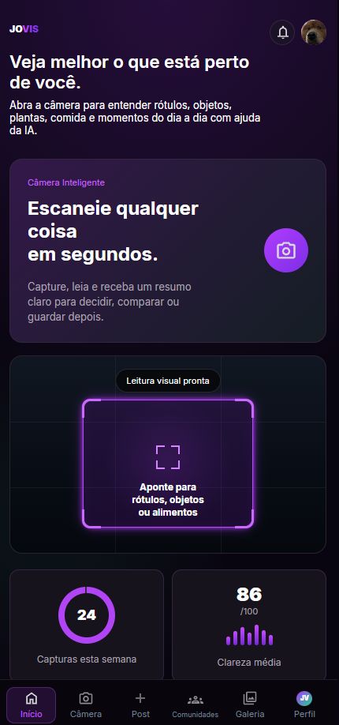
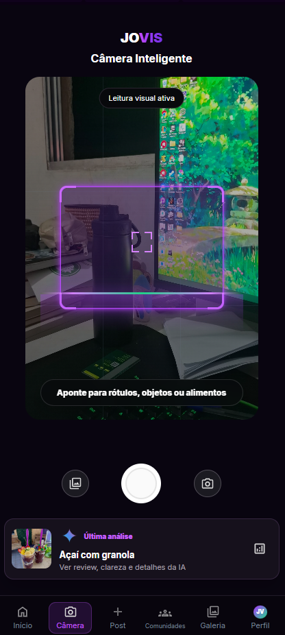
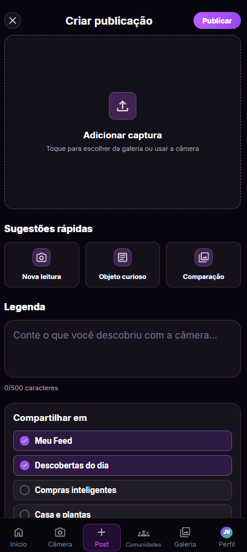
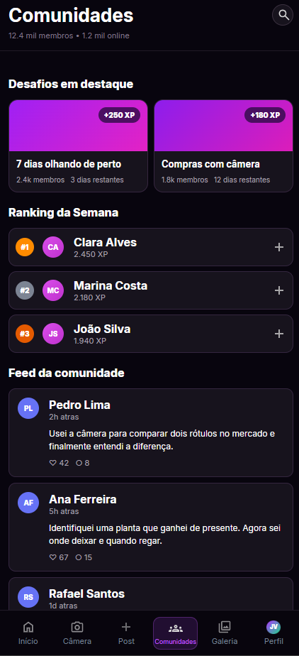

### **As nossas lentes te entregam outra visão.**

Projeto desenvolvido para o **FIAP Challenge · JOVI** (Turma ADS ON E · Disciplina de Análise e Desenvolvimento de Sistemas), com o objetivo de reinventar a experiência de câmera dos smartphones JOVI, tornando-a mais inteligente, intuitiva e social.

---

## 📌 O Desafio

A JOVI Smartphone identificou quatro problemas centrais na experiência atual de câmera de seus aparelhos:

- **Câmera desatualizada** — experiência de câmera lenta e ultrapassada.
- **Usuários frustrados** — complexidade excessiva e baixo engajamento no produto.
- **Falta de uma solução 100% web** — necessidade de uma plataforma mobile first, sem instalação, acessível direto pelo navegador.
- **Objetivo central** — reduzir a frustração do usuário, elevar a performance percebida e maximizar o engajamento.

## 💡 Nossa Solução: JOVIS

O JOVIS é uma plataforma web que transforma a câmera do smartphone em uma ferramenta inteligente de reconhecimento visual, unida a uma camada social de compartilhamento e descoberta.

| Recurso | Descrição |
|---|---|
| 📷 **Câmera Inteligente** | IA que escaneia rótulos, plantas, objetos e alimentos em tempo real. |
| 📊 **Resumos Claros** | Informações nutricionais, cuidados e comparações instantâneas geradas pela IA. |
| 🌐 **Camada Social** | Posts, comunidades, galeria e perfil integrados em uma única experiência. |
| ⚡ **100% Web** | Roda direto no navegador, mobile first, sem necessidade de instalação. |

---

## 🖥️ Telas da Aplicação

### Tela Inicial
Reúne estatísticas de uso, sugestões do dia e atalhos rápidos para escanear rótulos, plantas e objetos.



### Câmera Inteligente (Scanner IA)
Aponte a câmera para rótulos, objetos, plantas ou alimentos e receba uma leitura instantânea com apoio de IA — tabela nutricional, identificação de plantas e comparações lado a lado.




### Criar Publicação
Transforme cada captura em uma publicação, com legenda e opções de compartilhamento na comunidade JOVIS.



### Comunidades
Desafios, ranking semanal e um feed com descobertas de outros usuários da comunidade JOVIS.




### Galeria
Todas as capturas recentes organizadas visualmente, para revisar e compartilhar quando quiser.


---

## 🗂️ Modelagem de Dados

O Diagrama de Entidade-Relacionamento (MER) foi entregue na Sprint 1 e está validado para implementação. As principais entidades do sistema são:

- **Usuários** — perfis e autenticação
- **Scans** — histórico de capturas realizadas via IA
- **Comunidades** — grupos e publicações
- **Galeria** — capturas organizadas

**Relacionamentos principais:**
- Usuários → Scans: um usuário possui múltiplos registros de scans.
- Usuários → Publicações: usuários criam e publicam conteúdos.
- Publicações → Comunidades: publicações pertencem a uma comunidade.
- Galeria → Scans: a galeria armazena todos os scans do usuário.

---

## 🛠️ Tecnologias Utilizadas

Stack 100% web, escolhida para garantir compatibilidade máxima e entrega rápida, conforme escopo definido pelo desafio:

- **HTML5** — estrutura semântica e acessível
- **CSS3** — design responsivo e animações fluidas
- **JavaScript** — interatividade e lógica da câmera

---

## 🚀 Como Rodar o Projeto Localmente

O projeto é 100% front-end (HTML, CSS e JavaScript puro), então não é necessário instalar dependências ou configurar um back-end.

### Opção 1 — Live Server (recomendado, via VSCode)

1. Clone o repositório:
   ```bash
   git clone https://github.com/NRLacerda/jovis.git
   ```
2. Abra a pasta no VSCode:
   ```bash
   cd jovis
   code .
   ```
3. Instale a extensão **Live Server** (de Ritwick Dey) pela aba de Extensões do VSCode.
4. Clique com o botão direito no arquivo `index.html` e selecione **"Open with Live Server"**.
5. O site abrirá automaticamente no navegador (geralmente em `http://127.0.0.1:5500`).

### Opção 2 — Servidor HTTP simples (sem extensões)

1. Clone o repositório (veja o passo acima).
2. No terminal, dentro da pasta do projeto, rode:
   ```bash
   python3 -m http.server 8000
   ```
3. Acesse `http://localhost:8000` no navegador.

---

## 👥Projeto em equipe

Projeto desenvolvido em grupo para a disciplina de Análise e Desenvolvimento de Sistemas — FIAP, Turma ADS ON E, Setembro de 2026.


---

## 🔗 Links

- Repositório: [github.com/NRLacerda/jovis](https://github.com/NRLacerda/jovis)

- Github Erenice Barros: [github.com/erenicebarros](https://github.com/erenicebarros)